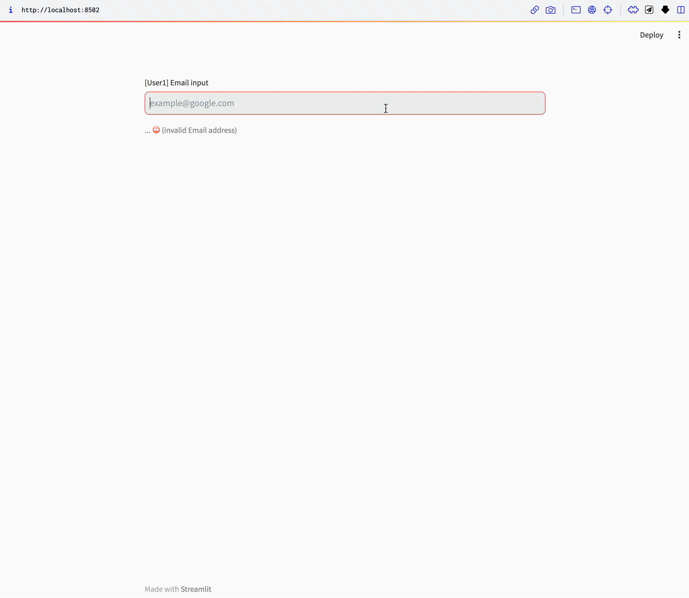
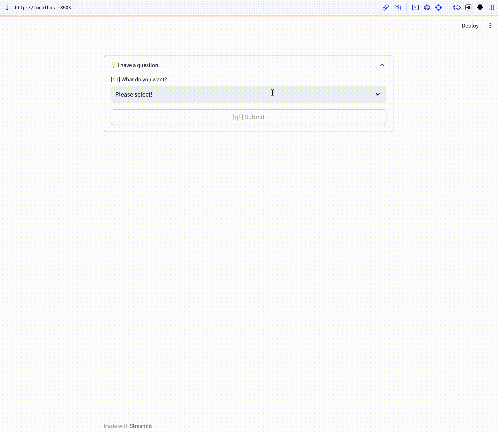

# StreamProto

StreamProto: High-Level Prototyping Component Sets Using Streamlit

## Requirements

- Python version >= 3.9
- Streamlit

## Main Features

- Intuitive state manager for Streamlit sessions
- Clean and easily readable code design
- Simple code examples provided for each module
- Modular design for gradual customization of assets (work in progress)
- Package installation design (work in progress)

## streamail



```bash
streamlit run src/streamail.py
```

## streamform



```bash
streamlit run src/streamform.py
```
